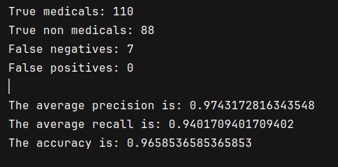

## Struttura del progetto

All'interno del repository sono presenti quattro entità principali:

- file `classifier.py`, contenente il classificatore, questo è il file da eseguire per verificare il funzionamento dell'assignment
- file `document_retriever.ipynb`, un notebook dentro il quale sono contenute le funzioni utilizzate per il download dei vari documenti tramite api di wikipedia
- directory `Corpora`, contenente il training set, che consiste di due cartelle, `Medical` e `Non Medical` ciascuna contenente i documenti necessari al training del classificatore
- directory `Test`, contenente il test set precedentemente estratto dal training set, le label assegnate a ciascun documento sono contenute nel file `test_labels.txt`, mentre i file relativi ai documenti su cui testare il classificatore sono nella directory `TestSet`

È inoltre presente un'ultima directory `CorporaBackup` che contiene tutti i documenti scaricati tramite utility `document_retriever.ipynb`, prima che questi vengano suddivisi in training e test set.

## `document_retriever.ipynb`

Come precedentemente accennato, questo file contiene le utility per la creazione di training e test set. In particolare in primo luogo viene creato il corpora iniziale, costituito di tutti i documenti (visibile nella directory `CorporaBackup`), in seguito viene diviso secondo la proporzione 80% training, 20% test.

Per i documenti medicali e non sono stati considerati documenti appartenenti a varie categorie:

```python
medical_categories = [
	"Category:Bacteriology",
	"Category:Virology",
	"Category:Cancer",
	"Category:Anatomy",
	"Category:Genetics",
	"Category:Pediatrics",
]

non_medical_categories = [
	"Category:Geometry",
	"Category:Literature",
	"Category:Hunting",
	"Category:Politics",
	"Category:Education",
	"Category:Fashion",
]
```

per ognuna di queste categorie è vengono ritornati al massimo 100 elementi attenenti alla particolare categoria. Si può osservare che in `CorporaBackup` i file in ogni directory prima che vengano divisi in training e test set non sono 600 e 600, come ci si aspetterebbe, questo perché per alcune categorie vengono trovati meno di 100 documenti.

Per dividere i documenti in training e test set viene utilizzata la funzione `populate_test_set()` del notebook `document_retriever.ipynb`.

## `classifier.py`

Si tratta di una classe che include tutte le utility principali del classificatore. Alla generazione del classificatore vengono svolti i seguenti passi:

- costruite le due *bag of words* relative alle due categorie **medical** e **non-medical**
- costruito il *vocabolario*
- computate le *priors* per ciascuna delle due classi  

A questo punto la fase di training si può ritenere completa, e si può procedere alla vera e propria classificazione: `Classifier.classify()`.

In particolare la classificazione viene effettuata tramite il metodo **Naive Bayes** secondo la formula:

$$
\hat{y} = \text{argmax} \;\; \text{log}(\text{P(class)}) + \sum_{i\in pos} \text{log}(p(w_i|\text{class}))
$$
Dopo aver eseguito la classificazione, verranno mostrati i risultati, che nello specifico caso di un'istanza di training e test set sono i seguenti:


